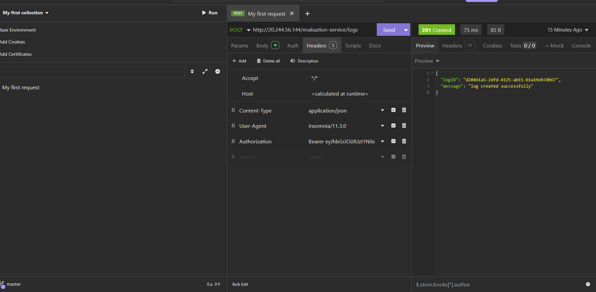
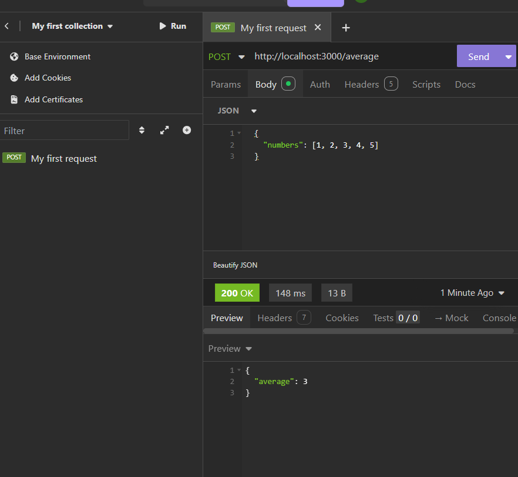

# 22RA1A0512
# Affordmed Backend Test Submission 🚀

This repo contains my submission for the Affordmed backend test challenge.

## 📁 Folder Structure
📁 Logging Middleware/
└── logger.ts

📁 Backend Test Submission/
├── app.ts
├── routes/average.ts
├── controllers/averageController.ts
├── middlewares/logMiddleware.ts
├── services/averageService.ts
└── postman/screenshots.png

---

## ✅ Features Implemented

1. **Logging Middleware**
   - Sends logs to the provided API
   - Includes `stack`, `level`, `package`, `message`
   - Uses `Bearer Token` in headers

2. **Average API**
   - Endpoint: `POST /average`
   - Input: `{ numbers: [1, 2, 3, 4, 5] }`
   - Output: `{ average: 3 }`

---
## Screenshots
1. Logging Middleware

2. Average_Api_Endpoint

## 🧪 How to Test

- Use Postman to test `/average` endpoint
- Log function auto-triggers and sends to the logging server

---

## 🔗 Contact

- 👨‍💻 Name: Mohd Anas Hussain
- 📧 Email: [md.anashussain555@gmail.com]
- 🔗 GitHub: https://github.com/anasrobo/22RA1A0512
